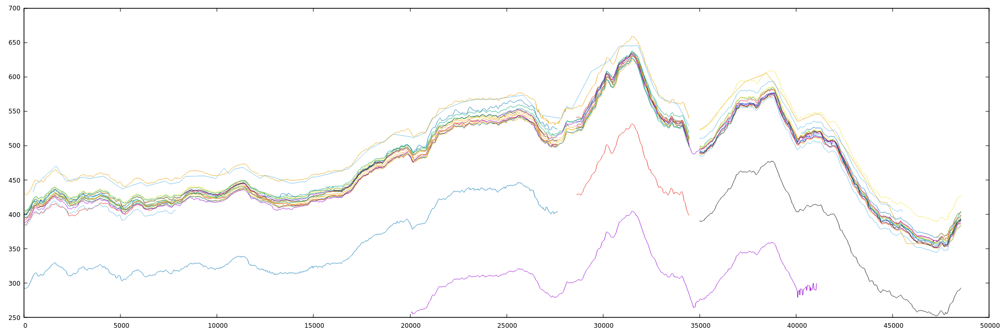
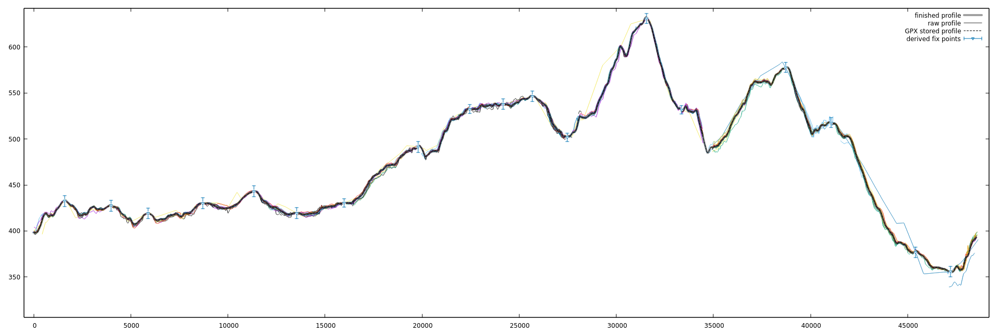

# Derive elevation for GPX track based on recorded activities

This python script will match recorded GPX activities (either in GPX or CSV format)
to a provided GPX track (a route) and calculate the elevation by statistical analyzing
the provided activities. The script was made for the cycling use case, ie routes
following roads. In theory it should work for other type of activities as well, but
it has not been tested for that.

For this to provide any meaningful result, the recorded GPX activities must be made
with GPS devices equipped with a barometric altimeter.

This is only a proof of concept, not much tested.

## How to run

With fix points and plotting of results:
./gpx-elevation.py --track demo-tracks/storuman-gravel-116km.gpx \
  --fix_points demo-tracks/fix-points.json --activities_dir demo-activities/ \
  --plot_dir gnuplot/

Without fix points and no plotting:
./gpx-elevation.py --track demo-tracks/storuman-gravel-116km.gpx \
  --activities_dir demo-activities/

Show parameters:
./gpx-elevation.py --help

## Some observations of GPS device behavior

For the test data when making this script the following behavior of used GPS devices
(cycling computers, such as Garmin Edge products) was observed:

- The overall elevation profile shape of different activity recordings matches quite well
  when altimeters are used
   - Absolute elevation can be off by much though
   - Vertical drift of absolute value of +/- 30 meters or so seems typical
   - Horizontal drift (lag in altimeter?) seems to be quite significant (up to 100 meters),
     requiring horizontal alignment too.
- Many of the modern GPS devices seems to have *some* understanding of absolute altitude,
  maybe by querying an elevation database via mobile phone connection?
   - To be able to derive a reasonable absolute elevation it's required that a majority
     of the recorded activtities is somewhat near the correct absolute altitude (+/-30
     meters or so.

The script expects provided actvitites to be recorded by devices that behave this way.

## Providing manual fix points

The script can derive elevation without any fix points, but to improve accuracy one can
provide a json file with manually provided fix points. See provided example.

## Notes

- It's preferred that the provided reference track/route is made using a routing tool
  using accurate maps, such that roads are correctly placed in 2D space and can
  match recorded activities. The reference route could be a recorded activty itself
  though.
- It will match all provided recorded activties to the reference route, by scanning
  20 meters perpendicularly sideways from the reference route to deal with GPX
  positioning errors. A recorded activity doesn't have to cover the full route, but
  it is preferable if there are at least some recorded activities that cover the
  full route.
- The elevation profiles from the activities will be anchored to provided fix points.
  If no fix points are provided, fix points are estimated based on statistical
  analysis of all matching activities.
- After all elevation profiles have been anchored, a "clustered average" on each
  point along the track is taken. A clustered average means that first the largest
  cluster of closeby profiles are identified, ignoring the rest, and then an average
  of those is taken.
    - The clustered average is robust against activity recordings with bad
      elevation data as those will generally be ignored as they will not belong
      to the largest cluster.
- To even out jaggies of the final elevation profile a low pass filter is applied.
    - By making smart post-processing or a clustered average that take surrounding
      values into account a smoother result could be made at this point, but from
      testing it seems that just applying a low pass filter yields a good enough
      result.
- The script is intended to work with very few recorded activities, even only 1 or 2.
- The result is unlikely to improve much after the route is covered with about 20
  activities.
- demo-activities contains real recorded activities, both good and bad data as would
  be expected in a real scenario. Also as in a real scenario some of the actitivities
  follow the demo tracks in full, some only partially.
- demo-tracks contains reference tracks (routes) in the same area as the demo
  activities. The fix-points.json contains LIDAR fix points for those tracks.
    - It's interesting to compare how close the results are with and without
      provided fix points.
- The more we low pass filter the output the less elevation gain we will get, as the
  small peaks/dips are smoothed out. A --filter_width of 50 meters seems to yield
  elevation gain matching typical GPS altimeters, but requires very good horizontal
  alignment. The default 100 meters is more conservative and will yield a bit lower
  elevation gain, but minimizes false details.
